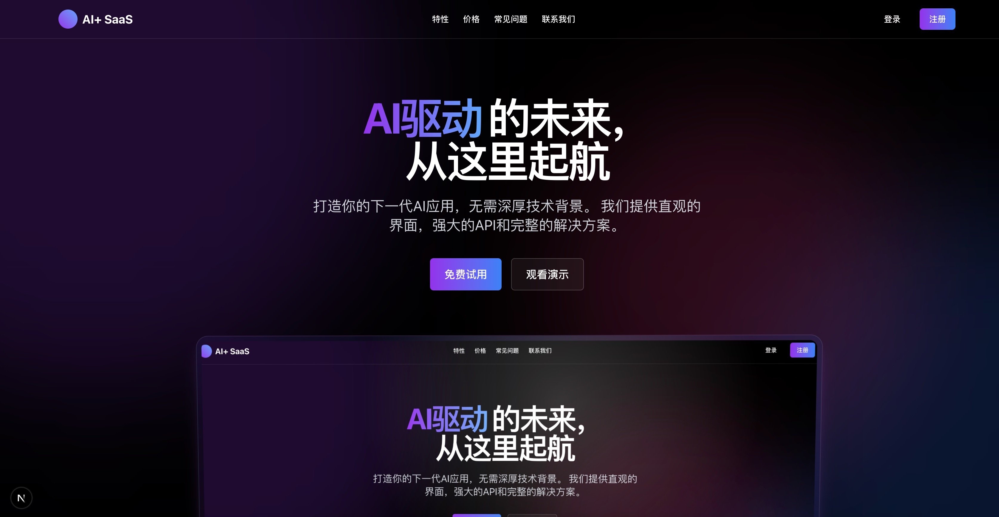
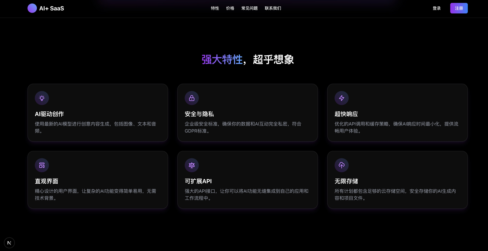
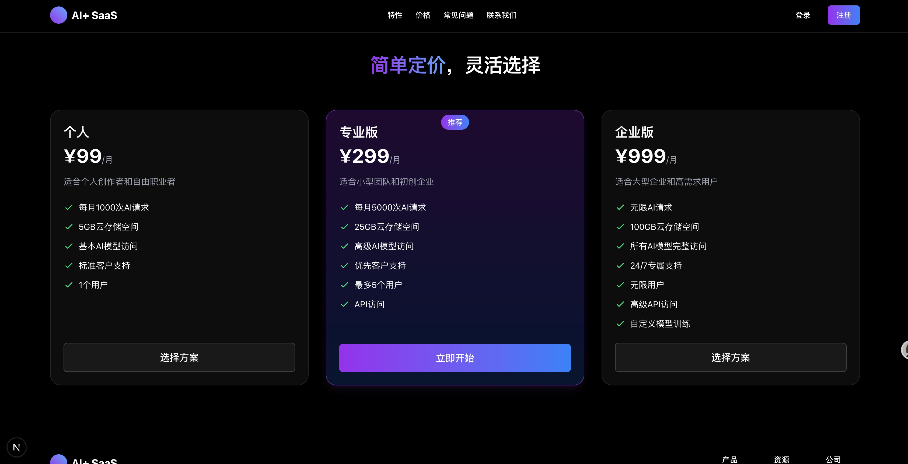

# AI+ SaaS 网站模板

一个现代化、高性能的AI驱动SaaS网站模板，适用于独立开发者快速构建专业级AI应用网站。设计灵感来源于[YouPhoto.ai](https://youphoto.ai/)等优秀AI产品网站，并进行了功能和用户体验的全面优化。





## 🌟 特性

- **炫酷现代UI**：采用玻璃态设计、流体动效和3D元素，打造沉浸式用户体验
- **响应式布局**：完美支持从手机到大屏显示器的各种设备
- **AI功能集成**：预设多种AI API集成方案（OpenAI、Replicate、Anthropic等）
- **完整用户系统**：注册、登录、个人资料、订阅管理
- **支付系统**：集成Stripe支付，支持订阅和一次性付费模式
- **使用限制系统**：基于信用或次数的用量限制机制
- **管理后台**：用户管理、数据分析、内容审核
- **SEO优化**：元数据管理、动态站点地图、结构化数据
- **多语言支持**：i18n国际化解决方案
- **深色/浅色模式**：自适应系统设置的主题切换

## 📋 技术栈

### 前端
- **框架**：Next.js 14 (App Router)
- **语言**：TypeScript
- **样式**：Tailwind CSS + Shadcn UI
- **状态管理**：Zustand
- **动效**：Framer Motion
- **3D效果**：Three.js / React Three Fiber
- **表单处理**：React Hook Form + Zod

### 后端
- **API**：Next.js API Routes / tRPC
- **数据库**：PostgreSQL + Prisma ORM
- **认证**：NextAuth.js / Clerk
- **文件存储**：AWS S3 / Cloudinary
- **缓存**：Redis
- **部署**：Vercel / Railway

### AI集成
- **图像生成**：Stable Diffusion / DALL-E / Midjourney API
- **文本处理**：OpenAI GPT / Claude
- **语音识别**：Whisper API
- **视频处理**：Runway / Replicate

## 🏗️ 项目结构

```
├── app/                  # Next.js App Router
│   ├── (auth)/           # 认证相关页面
│   ├── (dashboard)/      # 用户仪表盘
│   ├── (marketing)/      # 营销页面（首页、功能介绍等）
│   ├── api/              # API 端点
│   └── globals.css       # 全局样式
├── components/           # 共享组件
│   ├── ui/               # UI 基础组件
│   ├── layout/           # 布局组件
│   ├── marketing/        # 营销页面组件
│   ├── dashboard/        # 仪表盘组件
│   └── ai/               # AI功能相关组件
├── lib/                  # 工具函数和服务
│   ├── ai/               # AI服务封装
│   ├── db/               # 数据库相关
│   ├── auth/             # 认证相关
│   ├── payments/         # 支付相关
│   └── utils/            # 实用工具函数
├── prisma/               # Prisma ORM
│   └── schema.prisma     # 数据库模型
├── public/               # 静态资源
├── styles/               # 样式相关
└── ...
```

## 📱 页面结构

### 营销页面
- **首页**：产品展示、功能亮点、用户见证、价格方案
- **功能介绍**：详细功能说明、示例展示
- **定价页面**：订阅计划详情
- **博客**：AI相关内容、产品更新
- **常见问题**：FAQ页面
- **关于我们**：品牌故事
- **联系页面**：联系表单

### 用户页面
- **注册/登录**：用户认证
- **个人仪表盘**：概览、使用统计
- **AI工具界面**：各AI功能的操作界面
- **历史记录**：用户生成内容历史
- **设置**：账户、偏好设置
- **订阅管理**：计划选择、支付管理
- **API访问**：开发者API密钥管理

### 管理后台
- **用户管理**：用户列表、详情
- **内容审核**：用户生成内容审核
- **数据分析**：使用指标、转化率
- **系统设置**：全局配置

## 🚀 主要功能模块

### 用户系统
- 邮箱/社交媒体注册登录
- 用户角色与权限管理
- 个人资料管理
- 会话管理与安全

### 订阅与支付
- 多级订阅计划
- 一次性购买选项
- 优惠券与折扣系统
- 发票管理
- 支付处理与退款

### AI功能核心
- 图像生成/编辑
- 文本生成/分析
- 语音转文字/文字转语音
- 视频处理
- 自定义AI模型设置

### 使用限制系统
- 基于订阅的使用配额
- 超额使用计费
- 用量统计与显示
- 限制警告通知

### 内容管理
- 用户生成内容存储
- 内容分享功能
- 内容版本管理
- 收藏与整理

### 通知系统
- 邮件通知
- 浏览器推送
- 站内通知
- 自定义通知偏好

## 👨‍💻 开发与部署

### 本地开发
1. 克隆仓库
```bash
git clone https://github.com/yourusername/ai-saas-template.git
cd ai-saas-template
```

2. 安装依赖
```bash
npm install
# 或
yarn install
# 或
pnpm install
```

3. 环境变量设置
```bash
cp .env.example .env.local
# 编辑.env.local配置必要的API密钥和数据库连接
```

4. 启动开发服务器
```bash
npm run dev
# 或
yarn dev
# 或
pnpm dev
```

### 部署
- **Vercel部署**：连接GitHub仓库，配置环境变量
- **Docker部署**：使用提供的Dockerfile构建镜像
- **自托管**：支持传统服务器部署

## 🎨 UI/UX 亮点

### 视觉设计
- 玻璃态卡片与背景模糊效果
- 渐变色调与微妙的光效
- 精心设计的组件间隔与对齐
- 动态背景与互动元素

### 交互体验
- 页面过渡动画
- 滚动触发动效
- 微互动反馈
- 加载状态优化

### 特色元素
- 3D效果展示区
- 悬浮导航
- 交互式演示
- 实时预览功能

## 📈 扩展与自定义

### 主题定制
- 品牌色彩系统
- 组件样式覆盖
- 布局变体

### 插件系统
- 第三方服务集成
- 功能模块扩展
- 自定义AI提供商

### 白标解决方案
- 品牌元素替换
- 自定义域名支持
- 客户专属部署

## 📄 许可证

MIT © [C.G.W]

---

开始使用这个模板，快速构建你自己的AI SaaS产品！ 