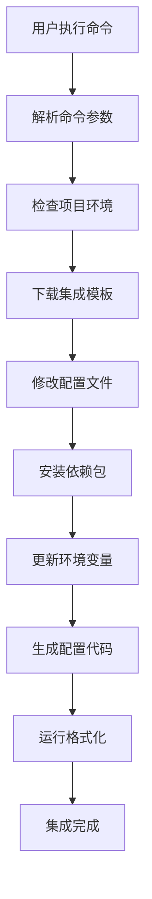

# Vibe CLI - SaaS 模板脚手架工具 PRD

## 📋 产品概述

Vibe CLI 是一个专为个人开发者设计的 SaaS 模板脚手架工具，通过简单的命令行指令，快速集成各种主流中间件和服务，让开发者能够在几分钟内搭建出功能完整的 SaaS 应用基础架构。

### 🎯 产品愿景
让每个独立开发者都能在 30 分钟内搭建出企业级 SaaS 应用的基础框架，无需花费大量时间在重复的基础设施搭建上。

### 💡 核心价值主张
- **零配置快速集成**：`vibe install i18n` 一键完成国际化配置
- **最佳实践内置**：每个中间件都采用业界最佳实践配置
- **模块化设计**：按需安装，避免项目臃肿
- **开箱即用**：集成完成即可直接使用，无需额外配置

## 🚀 核心功能特性

### 1. 中间件快速集成
支持通过简单命令快速集成主流 SaaS 服务和中间件：

```bash
# 国际化支持
vibe install i18n

# 用户认证系统
vibe install auth --provider=clerk

# 支付系统
vibe install payments --provider=stripe

# 数据库配置
vibe install database --provider=supabase

# 邮件服务
vibe install email --provider=resend

# 文件存储
vibe install storage --provider=cloudinary

# 监控分析
vibe install analytics --provider=mixpanel
```

### 2. 项目模板管理
```bash
# 创建新项目
vibe create my-saas --template=ai-saas

# 查看可用模板
vibe templates list

# 添加自定义模板
vibe templates add --name=custom --path=./template
```

### 3. 配置管理
```bash
# 查看当前配置
vibe config list

# 设置全局配置
vibe config set --key=default-provider --value=vercel

# 环境变量管理
vibe env set --key=STRIPE_SECRET_KEY --value=sk_test_xxx
```

### 4. 项目状态检查
```bash
# 检查项目健康状态
vibe health

# 检查缺失的依赖
vibe doctor

# 更新已安装的中间件
vibe update --all
```

## 🏗️ 支持的中间件和服务

### 认证服务 (Auth)
| 提供商 | 安装命令 | 特性 |
|--------|----------|------|
| Clerk | `vibe install auth --provider=clerk` | 开箱即用UI、社交登录 |
| NextAuth | `vibe install auth --provider=nextauth` | 灵活配置、多提供商 |
| Supabase Auth | `vibe install auth --provider=supabase` | 开源、数据库集成 |

### 支付系统 (Payments)
| 提供商 | 安装命令 | 特性 |
|--------|----------|------|
| Stripe | `vibe install payments --provider=stripe` | 全球支付、订阅管理 |
| Paddle | `vibe install payments --provider=paddle` | 税务处理、全球合规 |
| LemonSqueezy | `vibe install payments --provider=lemonsqueezy` | 独立开发者友好 |

### 数据库服务 (Database)
| 提供商 | 安装命令 | 特性 |
|--------|----------|------|
| Supabase | `vibe install database --provider=supabase` | PostgreSQL、实时功能 |
| PlanetScale | `vibe install database --provider=planetscale` | MySQL、分支管理 |
| Neon | `vibe install database --provider=neon` | PostgreSQL、无服务器 |

### 国际化 (i18n)
| 方案 | 安装命令 | 特性 |
|------|----------|------|
| next-intl | `vibe install i18n --provider=next-intl` | Next.js 优化、静态生成 |
| react-i18next | `vibe install i18n --provider=react-i18next` | 成熟方案、丰富生态 |

### 邮件服务 (Email)
| 提供商 | 安装命令 | 特性 |
|--------|----------|------|
| Resend | `vibe install email --provider=resend` | 现代API、开发者友好 |
| SendGrid | `vibe install email --provider=sendgrid` | 企业级、高送达率 |
| Mailgun | `vibe install email --provider=mailgun` | 灵活配置、强大API |

### 文件存储 (Storage)
| 提供商 | 安装命令 | 特性 |
|--------|----------|------|
| Cloudinary | `vibe install storage --provider=cloudinary` | 图片处理、CDN |
| AWS S3 | `vibe install storage --provider=s3` | 可靠稳定、成本控制 |
| Supabase Storage | `vibe install storage --provider=supabase` | 开源、权限控制 |

### 分析监控 (Analytics)
| 提供商 | 安装命令 | 特性 |
|--------|----------|------|
| Mixpanel | `vibe install analytics --provider=mixpanel` | 用户行为分析 |
| PostHog | `vibe install analytics --provider=posthog` | 开源、功能全面 |
| Google Analytics | `vibe install analytics --provider=ga4` | 免费、网站分析 |

### 部署服务 (Deployment)
| 提供商 | 安装命令 | 特性 |
|--------|----------|------|
| Vercel | `vibe install deploy --provider=vercel` | Next.js 原生支持 |
| Netlify | `vibe install deploy --provider=netlify` | 静态站点、边缘函数 |
| Railway | `vibe install deploy --provider=railway` | 全栈部署、数据库 |

## 🛠️ 技术实现方案

### 1. CLI 架构设计

```
vibe-cli/
├── bin/
│   └── vibe                 # CLI 入口文件
├── src/
│   ├── commands/            # 命令处理器
│   │   ├── install.ts
│   │   ├── create.ts
│   │   ├── config.ts
│   │   └── health.ts
│   ├── integrations/        # 中间件集成器
│   │   ├── auth/
│   │   │   ├── clerk.ts
│   │   │   ├── nextauth.ts
│   │   │   └── supabase.ts
│   │   ├── payments/
│   │   │   ├── stripe.ts
│   │   │   ├── paddle.ts
│   │   │   └── lemonsqueezy.ts
│   │   └── ...
│   ├── templates/           # 项目模板
│   │   ├── ai-saas/
│   │   ├── ecommerce/
│   │   └── landing-page/
│   ├── utils/               # 工具函数
│   │   ├── file-manager.ts
│   │   ├── env-manager.ts
│   │   └── package-manager.ts
│   └── types/               # TypeScript 类型定义
├── templates/               # 模板文件
└── package.json
```

### 2. 核心技术栈

#### CLI 框架
- **Commander.js**：命令行解析和处理
- **Inquirer.js**：交互式命令行界面
- **Chalk**：终端颜色输出
- **Ora**：加载动画效果

#### 文件操作
- **fs-extra**：增强的文件系统操作
- **Handlebars**：模板引擎
- **Prettier**：代码格式化
- **ESLint**：代码质量检查

#### 包管理
- **npm/yarn/pnpm**：支持多种包管理器
- **spawn**：执行子进程命令
- **semver**：版本管理

### 3. 集成工作流程



### 4. 配置文件结构

#### vibe.config.js
```javascript
module.exports = {
  // 项目元信息
  project: {
    name: 'my-saas',
    version: '1.0.0',
    template: 'ai-saas'
  },
  
  // 已安装的集成
  integrations: {
    auth: {
      provider: 'clerk',
      version: '6.16.0',
      config: {
        publishableKey: 'NEXT_PUBLIC_CLERK_PUBLISHABLE_KEY',
        secretKey: 'CLERK_SECRET_KEY'
      }
    },
    payments: {
      provider: 'stripe',
      version: '16.12.0',
      config: {
        publishableKey: 'NEXT_PUBLIC_STRIPE_PUBLISHABLE_KEY',
        secretKey: 'STRIPE_SECRET_KEY'
      }
    }
  },
  
  // 全局配置
  settings: {
    packageManager: 'npm',
    typescript: true,
    tailwind: true,
    eslint: true
  }
}
```

## 💻 使用示例

### 1. 创建新项目
```bash
# 使用 AI SaaS 模板创建项目
vibe create my-ai-app --template=ai-saas

# 交互式创建
vibe create
? 项目名称: my-ai-app
? 选择模板: AI SaaS Template
? 包管理器: npm
? 启用 TypeScript: Yes
? 启用 Tailwind CSS: Yes
```

### 2. 集成认证系统
```bash
# 安装 Clerk 认证
vibe install auth --provider=clerk

# 交互式安装
vibe install auth
? 选择认证提供商: Clerk
? 是否需要社交登录: Yes
? 选择社交登录平台: Google, GitHub
```

### 3. 集成支付系统
```bash
# 安装 Stripe 支付
vibe install payments --provider=stripe --subscription=true

# 配置会自动添加到项目中
# - Stripe 组件
# - 订阅管理页面
# - Webhook 处理
# - 价格计划配置
```

### 4. 国际化配置
```bash
# 安装国际化支持
vibe install i18n --provider=next-intl --locales=en,zh,ja

# 自动生成语言文件结构
messages/
├── en.json
├── zh.json
└── ja.json
```

## 🔧 高级功能

### 1. 自定义集成
开发者可以创建自定义集成器：

```typescript
// integrations/custom/my-service.ts
import { Integration } from '@vibe-cli/core'

export class MyServiceIntegration extends Integration {
  name = 'my-service'
  
  async install(options: any) {
    // 安装依赖
    await this.installPackages(['my-service-sdk'])
    
    // 修改配置文件
    await this.updateConfig({
      'my-service': {
        apiKey: 'MY_SERVICE_API_KEY'
      }
    })
    
    // 生成代码文件
    await this.generateFiles({
      'lib/my-service.ts': this.getTemplate('my-service-lib')
    })
  }
}
```

### 2. 插件系统
```bash
# 安装社区插件
vibe plugin install @vibe-cli/plugin-monitoring

# 查看已安装插件
vibe plugin list

# 卸载插件
vibe plugin uninstall @vibe-cli/plugin-monitoring
```

### 3. 模板市场
```bash
# 浏览模板市场
vibe marketplace browse

# 安装社区模板
vibe template install @community/blog-template

# 发布模板
vibe template publish --name=my-template
```

## 📊 项目规模和时间安排

### Phase 1: 核心功能开发 (2-3个月)
- [ ] CLI 基础框架搭建
- [ ] 文件操作和模板引擎
- [ ] 前5个核心集成器开发
  - [ ] 认证 (Clerk, NextAuth)
  - [ ] 支付 (Stripe)
  - [ ] 数据库 (Supabase, PlanetScale)
  - [ ] 国际化 (next-intl)
  - [ ] 部署 (Vercel)

### Phase 2: 集成扩展 (1-2个月)
- [ ] 邮件服务集成
- [ ] 文件存储集成
- [ ] 分析监控集成
- [ ] 更多认证和支付提供商

### Phase 3: 高级功能 (1-2个月)
- [ ] 插件系统
- [ ] 自定义集成 API
- [ ] 模板市场
- [ ] 图形化界面 (Web Dashboard)

### Phase 4: 生态建设 (持续进行)
- [ ] 社区建设
- [ ] 文档完善
- [ ] 视频教程制作
- [ ] 合作伙伴对接

## 📈 商业模式

### 免费版本
- 基础集成器（5个）
- 社区支持
- 开源模板

### 专业版本 ($29/月)
- 全部集成器
- 优先技术支持
- 高级模板
- 自定义集成 API

### 企业版本 ($99/月)
- 白标定制
- 专属技术支持
- 企业级集成
- 培训服务

## 🎯 成功指标

### 技术指标
- CLI 安装时间 < 30秒
- 单个集成完成时间 < 2分钟
- 支持 95% 的主流 SaaS 服务
- 代码测试覆盖率 > 90%

### 业务指标
- 6个月内获得 10,000+ 活跃用户
- 社区贡献的集成器 > 50个
- 客户满意度 > 4.5/5
- 月活跃用户增长率 > 20%

## 🤝 社区和生态

### 开源贡献
- GitHub 主仓库维护
- 社区集成器贡献机制
- 文档翻译计划
- 定期技术分享

### 合作伙伴
- SaaS 服务提供商官方合作
- 独立开发者社区推广
- 技术博主内容合作
- 在线教育平台课程合作

## 📚 相关资源

### 技术文档
- [集成器开发指南](./integration-guide.md)
- [模板创建教程](./template-guide.md)
- [API 参考文档](./api-reference.md)

### 社区资源
- [Discord 社区](https://discord.gg/vibe-cli)
- [GitHub 讨论区](https://github.com/vibe-cli/discussions)
- [官方博客](https://blog.vibe-cli.com)

---

**Vibe CLI - 让 SaaS 开发变得简单快捷！** 🚀 